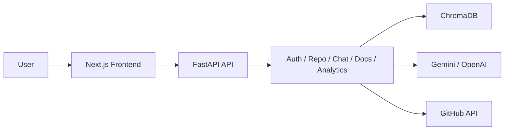

# TeamFlow AI

[](https://www.python.org/)
[](https://fastapi.tiangolo.com/)
[](https://nextjs.org/)
[](https://www.typescriptlang.org/)

TeamFlow AI is an AI-powered codebase understanding platform that helps developers explore GitHub repositories through natural-language chat, architecture analysis, dependency tracing, and automated documentation generation. It combines a FastAPI backend, a Next.js frontend, and a retrieval-augmented generation (RAG) pipeline to turn raw code into interactive knowledge.

## Why This Project Matters

Modern software projects are difficult to onboard, understand, and maintain. TeamFlow AI reduces that friction by giving teams a conversational interface for asking questions about their codebase and receiving grounded answers based on real repository content.

## Key Features

- AI-powered code chat with repository-aware responses
- GitHub repository ingestion and indexing
- Architecture exploration and dependency insights
- Automated documentation generation
- Hybrid retrieval using dense and sparse search
- Analytics dashboard for query trends and confidence scoring
- Secure authentication flow for multi-user use

## Tech Stack

### Backend
- Python
- FastAPI
- SQLAlchemy
- Pydantic
- ChromaDB
- Gemini / OpenAI APIs
- JWT authentication

### Frontend
- Next.js
- React
- TypeScript
- Tailwind CSS
- Zustand
- Framer Motion

## System Architecture



## Project Structure

```text
teamflow-ai/
├── backend/
│   ├── app/
│   │   ├── api/
│   │   ├── core/
│   │   ├── rag/
│   │   └── services/
│   └── requirements.txt
├── frontend/
│   ├── app/
│   ├── components/
│   └── lib/
├── docs/
├── docker/
└── README.md
```

## Getting Started

### Prerequisites

- Python 3.11+
- Node.js 18+
- npm or pnpm
- A Gemini or OpenAI API key for AI features

### Backend Setup

```bash
cd backend
python -m venv .venv

# Windows
.\.venv\Scripts\activate

# macOS / Linux
source .venv/bin/activate

pip install -r requirements.txt
```

Create environment variables for the backend:

```env
GEMINI_API_KEY=your_gemini_key
OPENAI_API_KEY=your_openai_key
```

Run the API server:

```bash
uvicorn app.main:app --host 0.0.0.0 --port 8000 --reload
```

API docs will be available at:
- http://localhost:8000/api/docs
- http://localhost:8000/api/redoc

### Frontend Setup

```bash
cd frontend
npm install
npm run dev
```

Open http://localhost:3000 to view the app.

### Docker Setup (Optional)

```bash
docker compose -f docker/docker-compose.yml up --build
```

## API Endpoints

The backend exposes these versioned API routes:

- /api/v1/auth/*
- /api/v1/repositories/*
- /api/v1/chat/*
- /api/v1/analytics/*
- /api/v1/documentation/*
- /api/v1/architecture/*

## Development Notes

- The backend is organized into modular services for authentication, repository processing, chat workflows, documentation, and analytics.
- The RAG pipeline is designed for semantic retrieval and grounded response generation.
- The frontend is built as a polished dashboard experience for code exploration and analysis.

## Roadmap

- Expand multi-repository knowledge graphs
- Improve retrieval quality and reranking performance
- Strengthen enterprise authentication and authorization
- Add cloud deployment support
- Improve documentation and visualization features

## Author

Muhammad Saad

- GitHub: [@MuhammadSaad1424](https://github.com/MuhammadSaad1424)
- Email: khawajasaad1424@gmail.com
- Linkedin: https://www.linkedin.com/in/muhammadsaad1424/

## License

This project is intended for academic and personal development use. Add an appropriate license file if you plan to distribute it publicly.
