# System Architecture & Design

## High-Level System Overview

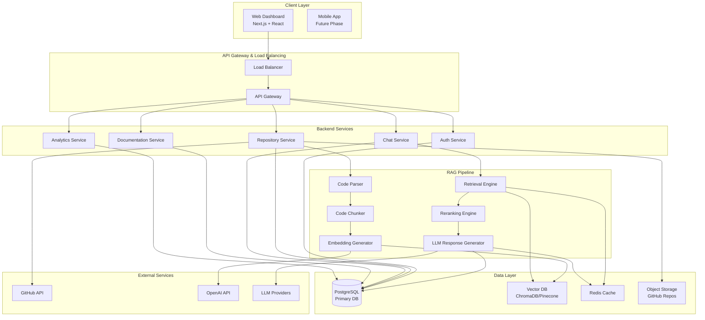

## Layered Architecture

### 1. Presentation Layer

**Components:**
- Web Dashboard (Next.js)
- Chat Interface
- Code Viewer
- Architecture Visualizer
- Analytics Dashboard

**Responsibilities:**
- User interaction
- Real-time updates
- Responsive design
- Accessibility compliance

### 2. API Layer

**Components:**
- API Gateway (FastAPI)
- Request validation
- Rate limiting
- CORS handling
- Response formatting

**Endpoints:**
- `/api/v1/auth/*` - Authentication
- `/api/v1/repositories/*` - Repository management
- `/api/v1/chat/*` - Conversation
- `/api/v1/documentation/*` - Document generation
- `/api/v1/analytics/*` - Analytics

### 3. Business Logic Layer

**Services:**
- **AuthService**: User authentication, OAuth integration
- **RepositoryService**: Repository ingestion, indexing
- **ChatService**: Conversation management, query routing
- **DocumentationService**: Document generation
- **AnalyticsService**: Usage tracking, metrics

### 4. RAG Pipeline Layer

**Components:**
- **Code Parser**: Extract code structure
- **Code Chunker**: Intelligent segmentation
- **Embedding Module**: Vector generation
- **Retrieval Module**: Hybrid search
- **Reranking Module**: Result ranking
- **Generation Module**: LLM response creation

### 5. Data Layer

**Components:**
- **PostgreSQL**: Relational data
- **Vector DB**: Embeddings storage
- **Redis**: Caching layer
- **Object Storage**: File storage

## RAG Pipeline Architecture

```mermaid
graph LR
    subgraph Input["Input"]
        REPO["GitHub Repository"]
        QUERY["User Query"]
    end
    
    subgraph Ingestion["Ingestion & Indexing"]
        CLONE["Clone Repository"]
        PARSE["Parse Code<br/>Tree-Sitter"]
        STRUCTURE["Extract Structure"]
        CHUNK["Chunk Code"]
        METADATA["Generate Metadata"]
    end
    
    subgraph Embedding["Embedding Generation"]
        PREP["Prepare Chunks"]
        EMBED["Generate Embeddings<br/>text-embedding-3-large"]
        BATCH["Batch Processing"]
    end
    
    subgraph Storage["Vector Storage"]
        INDEX["Create Index"]
        STORE["Store Vectors<br/>ChromaDB/Pinecone"]
        METADATA_STORE["Store Metadata<br/>PostgreSQL"]
    end
    
    subgraph QueryProcessing["Query Processing"]
        PREPROCESS["Preprocess Query"]
        EXPAND["Expand Query<br/>Synonyms, Variations"]
        HYBRID["Hybrid Search<br/>Dense + BM25"]
        RETRIEVE["Retrieve Top-K<br/>Results"]
    end
    
    subgraph Ranking["Ranking & Filtering"]
        RERANK["Cross-Encoder<br/>Reranking"]
        FILTER["Filter by<br/>Relevance"]
        CONTEXT["Build Context<br/>Window"]
    end
    
    subgraph Generation["Response Generation"]
        PROMPT["Build Prompt<br/>with Context"]
        LLM["Call LLM<br/>GPT-4o/Llama"]
        CITE["Generate Citations"]
        SCORE["Compute Confidence"]
    end
    
    subgraph Output["Output"]
        RESPONSE["Final Response"]
        SOURCES["Source Citations"]
        CONFIDENCE["Confidence Score"]
    end
    
    REPO --> CLONE
    CLONE --> PARSE
    PARSE --> STRUCTURE
    STRUCTURE --> CHUNK
    CHUNK --> METADATA
    METADATA --> PREP
    
    PREP --> EMBED
    EMBED --> BATCH
    BATCH --> INDEX
    INDEX --> STORE
    INDEX --> METADATA_STORE
    
    QUERY --> PREPROCESS
    PREPROCESS --> EXPAND
    EXPAND --> HYBRID
    HYBRID --> RETRIEVE
    
    RETRIEVE --> RERANK
    RERANK --> FILTER
    FILTER --> CONTEXT
    
    CONTEXT --> PROMPT
    PROMPT --> LLM
    LLM --> CITE
    CITE --> SCORE
    
    SCORE --> RESPONSE
    RESPONSE --> SOURCES
    SOURCES --> CONFIDENCE
```

## Component Interaction Diagram

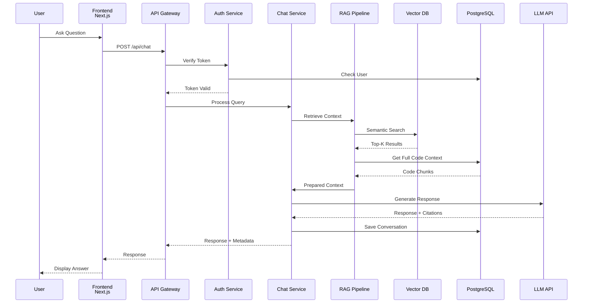

## Database Layer Architecture

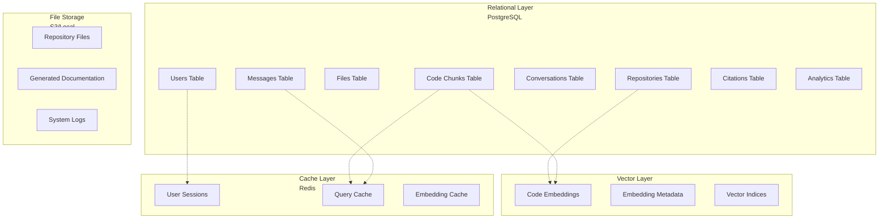

## Data Flow Diagram - Level 0

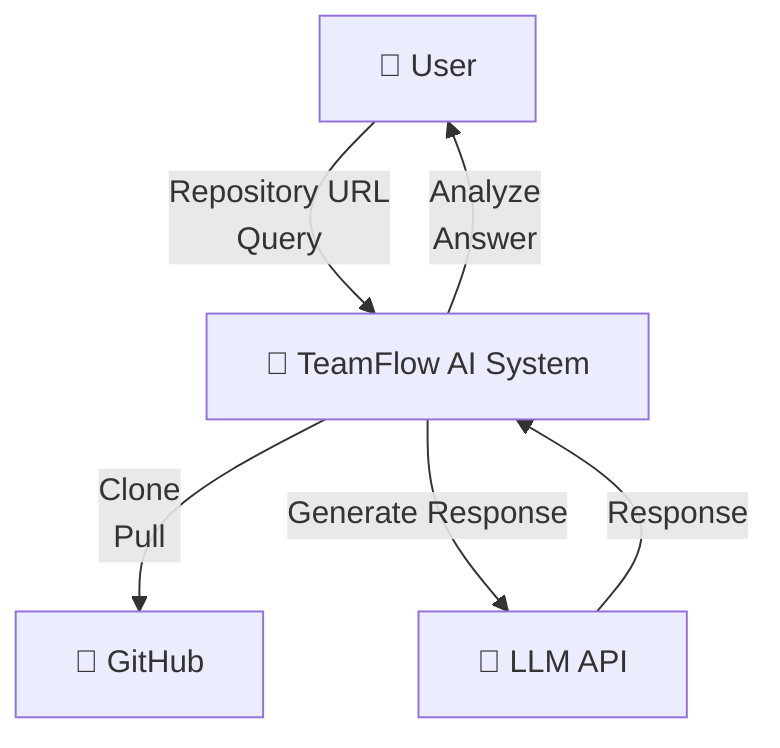

## Data Flow Diagram - Level 1

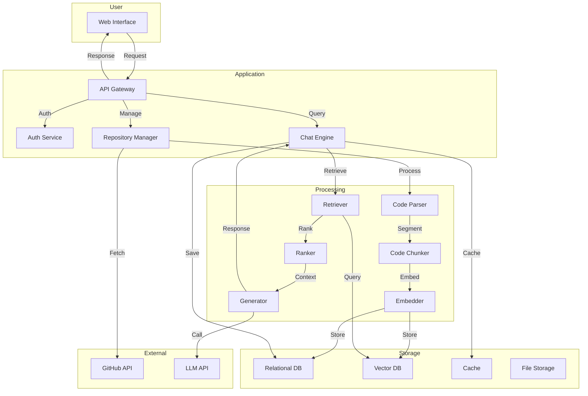

## Data Flow Diagram - Level 2 (Detailed Chat Flow)

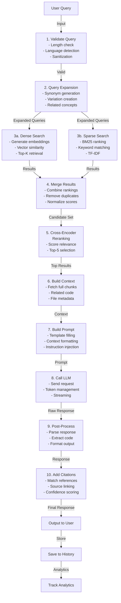

## Authentication Flow

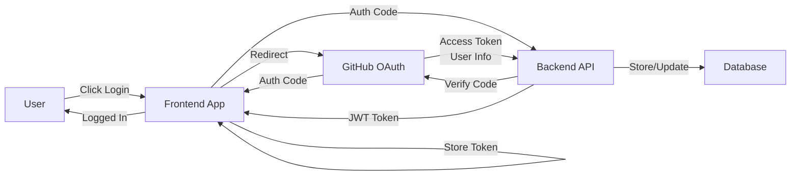

## Deployment Architecture

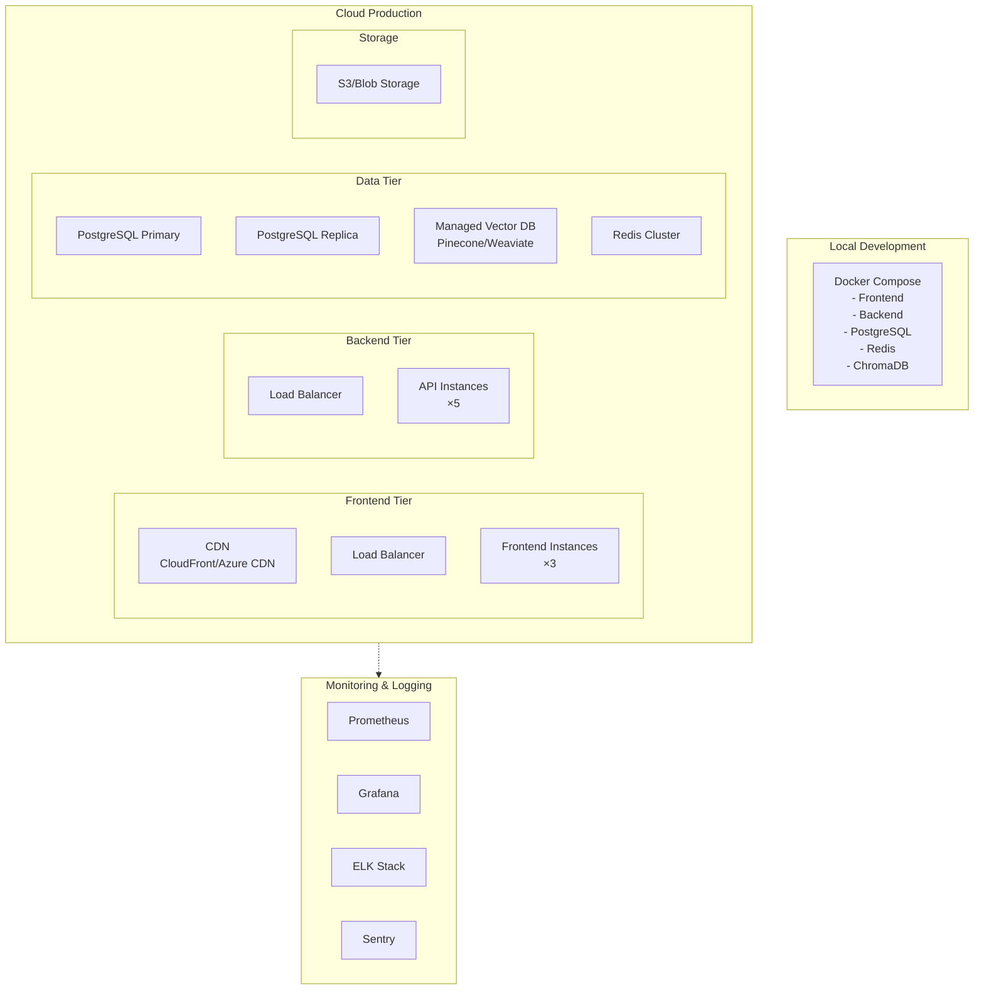

## Security Architecture

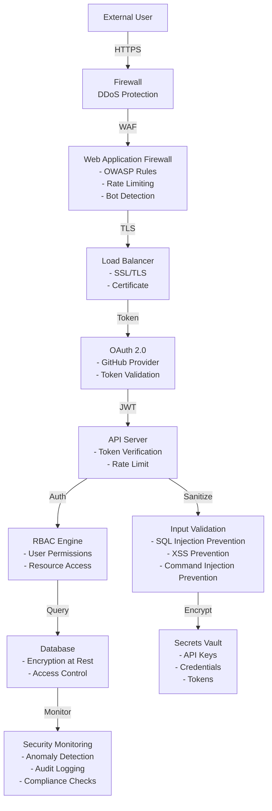

## Scalability Architecture

### Horizontal Scaling

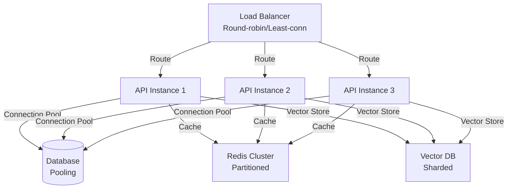

### Vertical Scaling

- Increase CPU/Memory for compute-intensive tasks
- Database tuning and indexing
- Cache optimization
- Connection pooling

## Performance Optimization Strategies

### Caching Strategy

1. **Query Result Cache**: Cache frequent queries (Redis)
2. **Embedding Cache**: Cache generated embeddings
3. **Citation Cache**: Cache source citations
4. **Metadata Cache**: Cache repository metadata

### Database Optimization

1. **Indexing**: Strategic index placement
2. **Partitioning**: Time-based and range partitioning
3. **Connection Pooling**: Efficient connection management
4. **Query Optimization**: Execution plan analysis

### Vector DB Optimization

1. **Indexing**: HNSW for similarity search
2. **Quantization**: Reduce memory footprint
3. **Batch Operations**: Batch inserts/updates
4. **Caching**: Popular embeddings in memory

## Disaster Recovery & HA

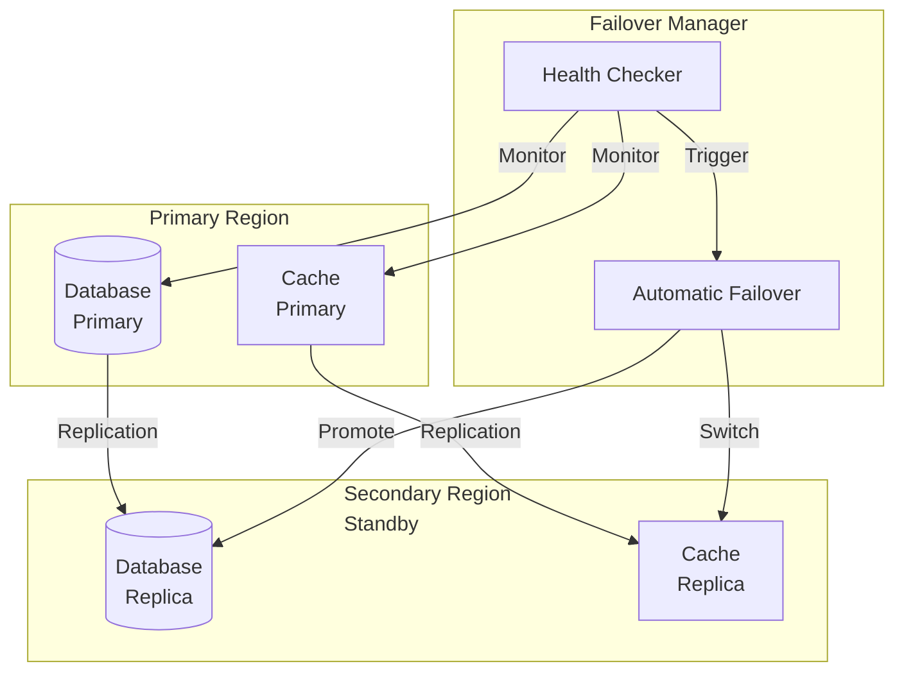

## API Gateway Pattern

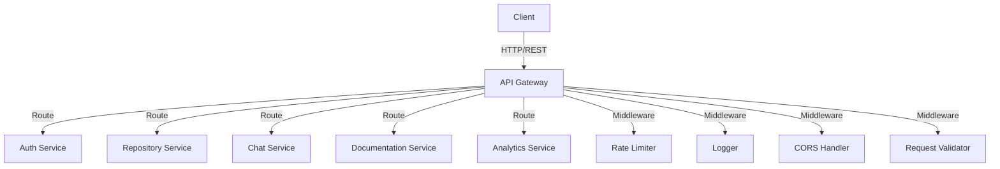

## Conclusion

This architecture follows industry best practices including:
- **Separation of Concerns**: Distinct layers with clear responsibilities
- **Scalability**: Horizontal and vertical scaling capabilities
- **Reliability**: High availability, disaster recovery, monitoring
- **Security**: Multiple security layers, encryption, access control
- **Performance**: Caching, indexing, optimization strategies
- **Maintainability**: Clear structure, modular design, documentation
