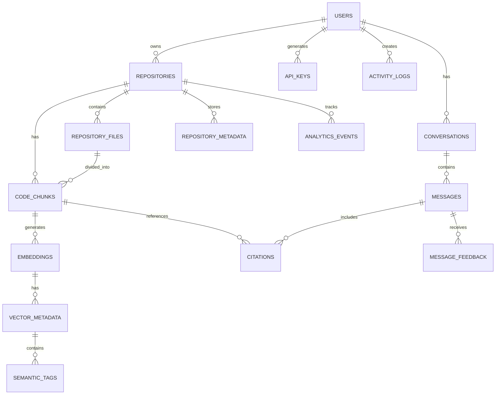

# Database Design & Schema

## Entity Relationship Diagram (ERD)



## Table Schemas

### 1. Users Table

```sql
CREATE TABLE users (
    id UUID PRIMARY KEY DEFAULT gen_random_uuid(),
    github_id INTEGER UNIQUE NOT NULL,
    github_username VARCHAR(255) NOT NULL,
    email VARCHAR(255) UNIQUE NOT NULL,
    avatar_url TEXT,
    display_name VARCHAR(255),
    bio TEXT,
    
    -- Authentication
    github_access_token VARCHAR(255) NOT NULL,
    github_refresh_token VARCHAR(255),
    github_token_expires_at TIMESTAMP,
    
    -- Status
    is_active BOOLEAN DEFAULT true,
    email_verified BOOLEAN DEFAULT false,
    subscription_tier VARCHAR(50) DEFAULT 'free', -- free, pro, enterprise
    subscription_expires_at TIMESTAMP,
    
    -- User Settings
    preferred_language VARCHAR(10) DEFAULT 'en',
    theme VARCHAR(20) DEFAULT 'auto', -- light, dark, auto
    notifications_enabled BOOLEAN DEFAULT true,
    
    -- Audit
    created_at TIMESTAMP DEFAULT CURRENT_TIMESTAMP,
    updated_at TIMESTAMP DEFAULT CURRENT_TIMESTAMP,
    last_login_at TIMESTAMP,
    deleted_at TIMESTAMP,
    
    CONSTRAINT subscription_tier_check CHECK (subscription_tier IN ('free', 'pro', 'enterprise')),
    CONSTRAINT theme_check CHECK (theme IN ('light', 'dark', 'auto'))
);

CREATE INDEX idx_users_github_id ON users(github_id);
CREATE INDEX idx_users_email ON users(email);
CREATE INDEX idx_users_is_active ON users(is_active);
```

### 2. Repositories Table

```sql
CREATE TABLE repositories (
    id UUID PRIMARY KEY DEFAULT gen_random_uuid(),
    user_id UUID NOT NULL REFERENCES users(id) ON DELETE CASCADE,
    
    -- Repository Info
    github_repo_id INTEGER UNIQUE,
    repo_name VARCHAR(255) NOT NULL,
    repo_url VARCHAR(500) NOT NULL,
    description TEXT,
    
    -- Repository Metadata
    language_primary VARCHAR(50),
    languages_detected TEXT[], -- JSON array
    file_count INTEGER,
    total_lines_of_code BIGINT,
    repository_size_kb INTEGER,
    
    -- GitHub Data
    github_stars INTEGER DEFAULT 0,
    github_forks INTEGER DEFAULT 0,
    github_last_updated TIMESTAMP,
    is_fork BOOLEAN DEFAULT false,
    is_private BOOLEAN DEFAULT false,
    
    -- Indexing Status
    indexing_status VARCHAR(50) DEFAULT 'pending', -- pending, in_progress, completed, failed
    indexing_started_at TIMESTAMP,
    indexing_completed_at TIMESTAMP,
    indexing_error_message TEXT,
    
    -- Embeddings Status
    embedding_status VARCHAR(50) DEFAULT 'pending',
    embedding_count INTEGER DEFAULT 0,
    
    -- Analysis
    last_analyzed_at TIMESTAMP,
    analysis_version INTEGER DEFAULT 1,
    
    -- Audit
    created_at TIMESTAMP DEFAULT CURRENT_TIMESTAMP,
    updated_at TIMESTAMP DEFAULT CURRENT_TIMESTAMP,
    deleted_at TIMESTAMP,
    
    CONSTRAINT indexing_status_check CHECK (indexing_status IN ('pending', 'in_progress', 'completed', 'failed')),
    CONSTRAINT embedding_status_check CHECK (embedding_status IN ('pending', 'in_progress', 'completed', 'failed'))
);

CREATE INDEX idx_repositories_user_id ON repositories(user_id);
CREATE INDEX idx_repositories_indexing_status ON repositories(indexing_status);
CREATE INDEX idx_repositories_github_repo_id ON repositories(github_repo_id);
```

### 3. Repository Files Table

```sql
CREATE TABLE repository_files (
    id UUID PRIMARY KEY DEFAULT gen_random_uuid(),
    repository_id UUID NOT NULL REFERENCES repositories(id) ON DELETE CASCADE,
    
    -- File Info
    file_path VARCHAR(1000) NOT NULL,
    file_name VARCHAR(255) NOT NULL,
    file_extension VARCHAR(20),
    file_size_bytes INTEGER,
    
    -- Content
    language VARCHAR(50),
    is_binary BOOLEAN DEFAULT false,
    is_test_file BOOLEAN DEFAULT false,
    is_documentation BOOLEAN DEFAULT false,
    
    -- Code Metrics
    line_count INTEGER,
    function_count INTEGER,
    class_count INTEGER,
    import_count INTEGER,
    
    -- Git Info
    last_modified_date TIMESTAMP,
    git_last_commit_sha VARCHAR(40),
    git_last_commit_message TEXT,
    
    -- Processing
    parsed_at TIMESTAMP,
    parser_version VARCHAR(20),
    
    -- Audit
    created_at TIMESTAMP DEFAULT CURRENT_TIMESTAMP,
    updated_at TIMESTAMP DEFAULT CURRENT_TIMESTAMP,
    
    UNIQUE(repository_id, file_path)
);

CREATE INDEX idx_repository_files_repo_id ON repository_files(repository_id);
CREATE INDEX idx_repository_files_extension ON repository_files(file_extension);
CREATE INDEX idx_repository_files_language ON repository_files(language);
```

### 4. Code Chunks Table

```sql
CREATE TABLE code_chunks (
    id UUID PRIMARY KEY DEFAULT gen_random_uuid(),
    repository_id UUID NOT NULL REFERENCES repositories(id) ON DELETE CASCADE,
    file_id UUID NOT NULL REFERENCES repository_files(id) ON DELETE CASCADE,
    
    -- Chunk Info
    chunk_index INTEGER NOT NULL,
    chunk_type VARCHAR(50), -- function, class, comment, import, etc.
    
    -- Content
    raw_content TEXT NOT NULL,
    cleaned_content TEXT,
    content_hash VARCHAR(64), -- SHA256 for deduplication
    
    -- Metadata
    language VARCHAR(50),
    start_line_number INTEGER,
    end_line_number INTEGER,
    start_char_offset INTEGER,
    end_char_offset INTEGER,
    
    -- Semantic Info
    entity_name VARCHAR(255), -- function/class name
    entity_type VARCHAR(50), -- function, class, method, etc.
    is_public BOOLEAN,
    documentation_text TEXT,
    
    -- Related Code
    depends_on_chunks UUID[],
    referenced_by_chunks UUID[],
    
    -- Embedding Info
    is_embedded BOOLEAN DEFAULT false,
    embedding_id VARCHAR(255),
    
    -- Audit
    created_at TIMESTAMP DEFAULT CURRENT_TIMESTAMP,
    updated_at TIMESTAMP DEFAULT CURRENT_TIMESTAMP,
    
    UNIQUE(repository_id, file_id, chunk_index)
);

CREATE INDEX idx_code_chunks_repo_id ON code_chunks(repository_id);
CREATE INDEX idx_code_chunks_file_id ON code_chunks(file_id);
CREATE INDEX idx_code_chunks_entity_name ON code_chunks(entity_name);
CREATE INDEX idx_code_chunks_chunk_type ON code_chunks(chunk_type);
```

### 5. Embeddings Table

```sql
CREATE TABLE embeddings (
    id UUID PRIMARY KEY DEFAULT gen_random_uuid(),
    code_chunk_id UUID NOT NULL REFERENCES code_chunks(id) ON DELETE CASCADE,
    repository_id UUID NOT NULL REFERENCES repositories(id) ON DELETE CASCADE,
    
    -- Embedding Info
    vector_id VARCHAR(255) NOT NULL,
    embedding_model VARCHAR(100) DEFAULT 'text-embedding-3-large',
    vector_dimension INTEGER DEFAULT 3072,
    
    -- Metadata
    content_summary TEXT,
    semantic_tags TEXT[], -- JSON array
    relevance_keywords TEXT[],
    
    -- Storage Location
    vector_db_provider VARCHAR(50), -- chromadb, pinecone, weaviate
    stored_at TIMESTAMP,
    
    -- Audit
    created_at TIMESTAMP DEFAULT CURRENT_TIMESTAMP,
    updated_at TIMESTAMP DEFAULT CURRENT_TIMESTAMP,
    
    UNIQUE(vector_id, vector_db_provider)
);

CREATE INDEX idx_embeddings_chunk_id ON embeddings(code_chunk_id);
CREATE INDEX idx_embeddings_repo_id ON embeddings(repository_id);
CREATE INDEX idx_embeddings_model ON embeddings(embedding_model);
```

### 6. Conversations Table

```sql
CREATE TABLE conversations (
    id UUID PRIMARY KEY DEFAULT gen_random_uuid(),
    user_id UUID NOT NULL REFERENCES users(id) ON DELETE CASCADE,
    repository_id UUID REFERENCES repositories(id) ON DELETE SET NULL,
    
    -- Conversation Metadata
    title VARCHAR(500),
    description TEXT,
    
    -- Content
    message_count INTEGER DEFAULT 0,
    is_pinned BOOLEAN DEFAULT false,
    is_archived BOOLEAN DEFAULT false,
    
    -- Models Used
    llm_model VARCHAR(100),
    embedding_model VARCHAR(100),
    vector_db_provider VARCHAR(50),
    
    -- Audit
    created_at TIMESTAMP DEFAULT CURRENT_TIMESTAMP,
    updated_at TIMESTAMP DEFAULT CURRENT_TIMESTAMP,
    last_message_at TIMESTAMP,
    deleted_at TIMESTAMP
);

CREATE INDEX idx_conversations_user_id ON conversations(user_id);
CREATE INDEX idx_conversations_repo_id ON conversations(repository_id);
CREATE INDEX idx_conversations_created_at ON conversations(created_at);
```

### 7. Messages Table

```sql
CREATE TABLE messages (
    id UUID PRIMARY KEY DEFAULT gen_random_uuid(),
    conversation_id UUID NOT NULL REFERENCES conversations(id) ON DELETE CASCADE,
    user_id UUID NOT NULL REFERENCES users(id) ON DELETE CASCADE,
    
    -- Message Type
    message_type VARCHAR(50) DEFAULT 'user', -- user, assistant
    
    -- Content
    query_text TEXT NOT NULL,
    response_text TEXT,
    
    -- Processing Info
    query_tokens INTEGER,
    response_tokens INTEGER,
    processing_time_ms INTEGER,
    
    -- Confidence & Quality
    confidence_score FLOAT,
    is_hallucinated BOOLEAN DEFAULT false,
    
    -- Feedback
    user_feedback VARCHAR(50), -- helpful, not_helpful, none
    feedback_text TEXT,
    
    -- Audit
    created_at TIMESTAMP DEFAULT CURRENT_TIMESTAMP,
    updated_at TIMESTAMP DEFAULT CURRENT_TIMESTAMP,
    
    CHECK (message_type IN ('user', 'assistant')),
    CHECK (confidence_score >= 0 AND confidence_score <= 1)
);

CREATE INDEX idx_messages_conversation_id ON messages(conversation_id);
CREATE INDEX idx_messages_user_id ON messages(user_id);
CREATE INDEX idx_messages_created_at ON messages(created_at);
```

### 8. Citations Table

```sql
CREATE TABLE citations (
    id UUID PRIMARY KEY DEFAULT gen_random_uuid(),
    message_id UUID NOT NULL REFERENCES messages(id) ON DELETE CASCADE,
    code_chunk_id UUID NOT NULL REFERENCES code_chunks(id) ON DELETE CASCADE,
    file_id UUID NOT NULL REFERENCES repository_files(id) ON DELETE CASCADE,
    
    -- Citation Info
    citation_index INTEGER,
    citation_type VARCHAR(50), -- direct, related, reference
    relevance_score FLOAT,
    
    -- Display Info
    snippet_text TEXT,
    start_line INTEGER,
    end_line INTEGER,
    
    -- Audit
    created_at TIMESTAMP DEFAULT CURRENT_TIMESTAMP
);

CREATE INDEX idx_citations_message_id ON citations(message_id);
CREATE INDEX idx_citations_chunk_id ON citations(code_chunk_id);
CREATE INDEX idx_citations_file_id ON citations(file_id);
```

### 9. Repository Metadata Table

```sql
CREATE TABLE repository_metadata (
    id UUID PRIMARY KEY DEFAULT gen_random_uuid(),
    repository_id UUID NOT NULL UNIQUE REFERENCES repositories(id) ON DELETE CASCADE,
    
    -- Architecture Info
    architecture_summary TEXT,
    main_modules TEXT[], -- JSON array
    key_services TEXT[],
    
    -- Dependencies
    external_dependencies TEXT[], -- JSON: package names
    internal_dependencies TEXT[], -- JSON: module dependencies
    
    -- Patterns Detected
    design_patterns TEXT[], -- JSON array
    architecture_patterns TEXT[],
    
    -- Statistics
    code_statistics JSONB,
    complexity_metrics JSONB,
    
    -- Generated Content
    auto_generated_readme TEXT,
    auto_generated_api_doc TEXT,
    
    -- Analysis Status
    last_analyzed_at TIMESTAMP,
    analysis_version INTEGER DEFAULT 1,
    
    -- Audit
    created_at TIMESTAMP DEFAULT CURRENT_TIMESTAMP,
    updated_at TIMESTAMP DEFAULT CURRENT_TIMESTAMP
);

CREATE INDEX idx_repo_metadata_repo_id ON repository_metadata(repository_id);
```

### 10. Analytics Events Table

```sql
CREATE TABLE analytics_events (
    id UUID PRIMARY KEY DEFAULT gen_random_uuid(),
    user_id UUID NOT NULL REFERENCES users(id) ON DELETE CASCADE,
    
    -- Event Info
    event_type VARCHAR(100) NOT NULL,
    event_name VARCHAR(255) NOT NULL,
    
    -- Context
    repository_id UUID REFERENCES repositories(id) ON DELETE SET NULL,
    conversation_id UUID REFERENCES conversations(id) ON DELETE SET NULL,
    
    -- Event Data
    event_data JSONB,
    
    -- Properties
    ip_address INET,
    user_agent TEXT,
    
    -- Timestamps
    created_at TIMESTAMP DEFAULT CURRENT_TIMESTAMP
);

CREATE INDEX idx_analytics_user_id ON analytics_events(user_id);
CREATE INDEX idx_analytics_event_type ON analytics_events(event_type);
CREATE INDEX idx_analytics_created_at ON analytics_events(created_at);
```

### 11. API Keys Table

```sql
CREATE TABLE api_keys (
    id UUID PRIMARY KEY DEFAULT gen_random_uuid(),
    user_id UUID NOT NULL REFERENCES users(id) ON DELETE CASCADE,
    
    -- Key Info
    key_hash VARCHAR(255) NOT NULL UNIQUE,
    key_prefix VARCHAR(20),
    
    -- Metadata
    name VARCHAR(255) NOT NULL,
    description TEXT,
    
    -- Status
    is_active BOOLEAN DEFAULT true,
    last_used_at TIMESTAMP,
    
    -- Security
    ip_whitelist INET[],
    rate_limit_per_hour INTEGER,
    
    -- Audit
    created_at TIMESTAMP DEFAULT CURRENT_TIMESTAMP,
    updated_at TIMESTAMP DEFAULT CURRENT_TIMESTAMP,
    expired_at TIMESTAMP
);

CREATE INDEX idx_api_keys_user_id ON api_keys(user_id);
CREATE INDEX idx_api_keys_key_hash ON api_keys(key_hash);
```

### 12. Activity Logs Table

```sql
CREATE TABLE activity_logs (
    id UUID PRIMARY KEY DEFAULT gen_random_uuid(),
    user_id UUID NOT NULL REFERENCES users(id) ON DELETE CASCADE,
    
    -- Activity Info
    action_type VARCHAR(100) NOT NULL,
    resource_type VARCHAR(100),
    resource_id VARCHAR(255),
    
    -- Details
    description TEXT,
    details JSONB,
    
    -- Status
    status VARCHAR(50) DEFAULT 'success', -- success, failed
    error_message TEXT,
    
    -- Audit
    created_at TIMESTAMP DEFAULT CURRENT_TIMESTAMP
);

CREATE INDEX idx_activity_logs_user_id ON activity_logs(user_id);
CREATE INDEX idx_activity_logs_action_type ON activity_logs(action_type);
```

### 13. Message Feedback Table

```sql
CREATE TABLE message_feedback (
    id UUID PRIMARY KEY DEFAULT gen_random_uuid(),
    message_id UUID NOT NULL UNIQUE REFERENCES messages(id) ON DELETE CASCADE,
    
    -- Feedback
    rating INTEGER CHECK (rating >= 1 AND rating <= 5),
    feedback_type VARCHAR(50), -- helpful, not_helpful, partially_helpful
    feedback_text TEXT,
    
    -- Categories
    accuracy BOOLEAN,
    completeness BOOLEAN,
    clarity BOOLEAN,
    
    -- Audit
    created_at TIMESTAMP DEFAULT CURRENT_TIMESTAMP,
    updated_at TIMESTAMP DEFAULT CURRENT_TIMESTAMP
);

CREATE INDEX idx_feedback_message_id ON message_feedback(message_id);
```

### 14. Vector Metadata Table

```sql
CREATE TABLE vector_metadata (
    id UUID PRIMARY KEY DEFAULT gen_random_uuid(),
    embedding_id UUID NOT NULL UNIQUE REFERENCES embeddings(id) ON DELETE CASCADE,
    
    -- Semantic Information
    semantic_tags TEXT[],
    context_keywords TEXT[],
    entities_mentioned TEXT[],
    
    -- Code Structure
    function_signatures TEXT[],
    class_definitions TEXT[],
    imports_used TEXT[],
    
    -- Relationships
    related_chunks UUID[],
    related_files VARCHAR[],
    
    -- Custom Attributes
    custom_metadata JSONB,
    
    -- Audit
    created_at TIMESTAMP DEFAULT CURRENT_TIMESTAMP,
    updated_at TIMESTAMP DEFAULT CURRENT_TIMESTAMP
);

CREATE INDEX idx_vector_metadata_embedding_id ON vector_metadata(embedding_id);
```

### 15. Session Table

```sql
CREATE TABLE sessions (
    id UUID PRIMARY KEY DEFAULT gen_random_uuid(),
    user_id UUID NOT NULL REFERENCES users(id) ON DELETE CASCADE,
    
    -- Session Info
    session_token VARCHAR(500) NOT NULL UNIQUE,
    refresh_token VARCHAR(500),
    
    -- Device/Browser
    user_agent TEXT,
    ip_address INET,
    device_type VARCHAR(50),
    
    -- Status
    is_active BOOLEAN DEFAULT true,
    is_revoked BOOLEAN DEFAULT false,
    
    -- Timestamps
    created_at TIMESTAMP DEFAULT CURRENT_TIMESTAMP,
    expires_at TIMESTAMP,
    last_activity_at TIMESTAMP,
    revoked_at TIMESTAMP
);

CREATE INDEX idx_sessions_user_id ON sessions(user_id);
CREATE INDEX idx_sessions_token ON sessions(session_token);
CREATE INDEX idx_sessions_expires_at ON sessions(expires_at);
```

## Complete Database Schema SQL

```sql
-- Enable UUID extension
CREATE EXTENSION IF NOT EXISTS "uuid-ossp";
CREATE EXTENSION IF NOT EXISTS "pg_trgm";

-- Create all tables
-- [All table creation statements from above]

-- Create Foreign Key Constraints
ALTER TABLE repositories ADD CONSTRAINT fk_repo_user FOREIGN KEY (user_id) REFERENCES users(id);
ALTER TABLE repository_files ADD CONSTRAINT fk_files_repo FOREIGN KEY (repository_id) REFERENCES repositories(id);
ALTER TABLE code_chunks ADD CONSTRAINT fk_chunks_repo FOREIGN KEY (repository_id) REFERENCES repositories(id);
ALTER TABLE code_chunks ADD CONSTRAINT fk_chunks_file FOREIGN KEY (file_id) REFERENCES repository_files(id);
ALTER TABLE embeddings ADD CONSTRAINT fk_embed_chunk FOREIGN KEY (code_chunk_id) REFERENCES code_chunks(id);
ALTER TABLE conversations ADD CONSTRAINT fk_conv_user FOREIGN KEY (user_id) REFERENCES users(id);
ALTER TABLE messages ADD CONSTRAINT fk_msg_conv FOREIGN KEY (conversation_id) REFERENCES conversations(id);
ALTER TABLE citations ADD CONSTRAINT fk_cite_msg FOREIGN KEY (message_id) REFERENCES messages(id);

-- Create Indexes for Performance
CREATE INDEX idx_users_active ON users(is_active) WHERE is_active = true;
CREATE INDEX idx_repos_indexing ON repositories(indexing_status) WHERE indexing_status != 'completed';
CREATE INDEX idx_chunks_search ON code_chunks USING GIN(to_tsvector('english', raw_content));
CREATE INDEX idx_files_search ON repository_files USING GIN(to_tsvector('english', file_name));

-- Create Views
CREATE VIEW user_repository_stats AS
SELECT 
    u.id,
    u.github_username,
    COUNT(DISTINCT r.id) as repository_count,
    COUNT(DISTINCT rc.id) as total_chunks,
    COUNT(DISTINCT c.id) as conversation_count,
    COUNT(DISTINCT m.id) as message_count
FROM users u
LEFT JOIN repositories r ON u.id = r.user_id
LEFT JOIN code_chunks rc ON r.id = rc.repository_id
LEFT JOIN conversations c ON u.id = c.user_id
LEFT JOIN messages m ON c.id = m.conversation_id
WHERE u.deleted_at IS NULL
GROUP BY u.id, u.github_username;

CREATE VIEW repository_analytics AS
SELECT 
    r.id,
    r.repo_name,
    COUNT(DISTINCT rf.id) as file_count,
    COUNT(DISTINCT rc.id) as chunk_count,
    COUNT(DISTINCT e.id) as embedding_count,
    AVG(rf.line_count) as avg_file_lines,
    SUM(rf.line_count) as total_lines
FROM repositories r
LEFT JOIN repository_files rf ON r.id = rf.repository_id
LEFT JOIN code_chunks rc ON r.id = rc.repository_id
LEFT JOIN embeddings e ON r.id = e.repository_id
WHERE r.deleted_at IS NULL
GROUP BY r.id, r.repo_name;

-- Create Triggers for Audit
CREATE OR REPLACE FUNCTION update_updated_at()
RETURNS TRIGGER AS $$
BEGIN
    NEW.updated_at = CURRENT_TIMESTAMP;
    RETURN NEW;
END;
$$ LANGUAGE plpgsql;

CREATE TRIGGER users_updated_at BEFORE UPDATE ON users
    FOR EACH ROW EXECUTE FUNCTION update_updated_at();

CREATE TRIGGER repositories_updated_at BEFORE UPDATE ON repositories
    FOR EACH ROW EXECUTE FUNCTION update_updated_at();

CREATE TRIGGER conversations_updated_at BEFORE UPDATE ON conversations
    FOR EACH ROW EXECUTE FUNCTION update_updated_at();
```

## Database Optimization

### Indexing Strategy

| Table | Column | Type | Reason |
|-------|--------|------|--------|
| users | github_id | Unique | Authentication lookup |
| users | email | Unique | Email verification |
| repositories | user_id | B-tree | User's repositories |
| repository_files | file_extension | B-tree | Language filtering |
| code_chunks | entity_name | B-tree | Search by function/class |
| code_chunks | raw_content | GiST/GIN | Full-text search |
| embeddings | code_chunk_id | B-tree | Chunk association |
| messages | created_at | B-tree | Timeline queries |
| analytics_events | event_type | B-tree | Event filtering |

### Partitioning Strategy

- **Messages Table**: Partition by month for older data archive
- **Analytics Events**: Partition by week for time-series analysis
- **Activity Logs**: Partition by month for log rotation

### Connection Pooling

- **PgBouncer**: Connection pooling layer
- **Pool Size**: 100 connections per server
- **Min Idle**: 10 connections
- **Timeout**: 30 seconds idle before disconnect

## Backup & Recovery

### Backup Strategy

```bash
# Daily full backup
pg_dump -Fc -U postgres teamflow_ai > backups/full_$(date +%Y%m%d).dump

# Hourly incremental with WAL archiving
wal_level = replica
archive_command = 'test ! -f /mnt/backup/wal_archive/%f && cp %p /mnt/backup/wal_archive/%f'
```

### Recovery Plan

1. **Point-in-Time Recovery (PITR)**: Restore from base backup + WAL segments
2. **Replication**: Standby replica for failover
3. **Recovery Time Objective (RTO)**: <5 minutes
4. **Recovery Point Objective (RPO)**: <1 minute

## Performance Benchmarks

Target metrics:
- **Query Response Time**: <100ms for 99th percentile
- **Insert Performance**: 10,000 records/second
- **Search Performance**: <500ms for full-text search on 1M records
- **Connection Time**: <50ms

## Conclusion

This database design provides:
- Normalized, efficient schema
- Comprehensive audit trails
- Optimized for read/write performance
- Scalable partitioning strategy
- Strong ACID guarantees
- Enterprise-grade reliability
