# UML & Design Diagrams

## Class Diagram - Backend Architecture

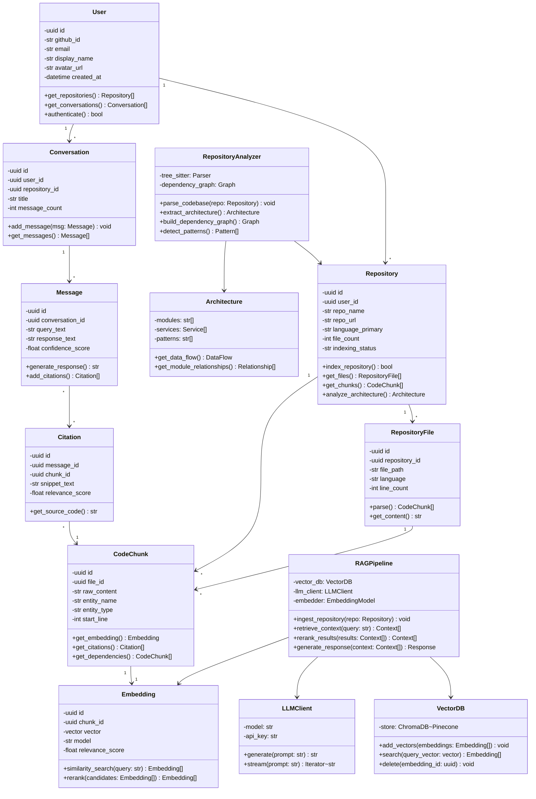

## Sequence Diagram - Repository Indexing Flow

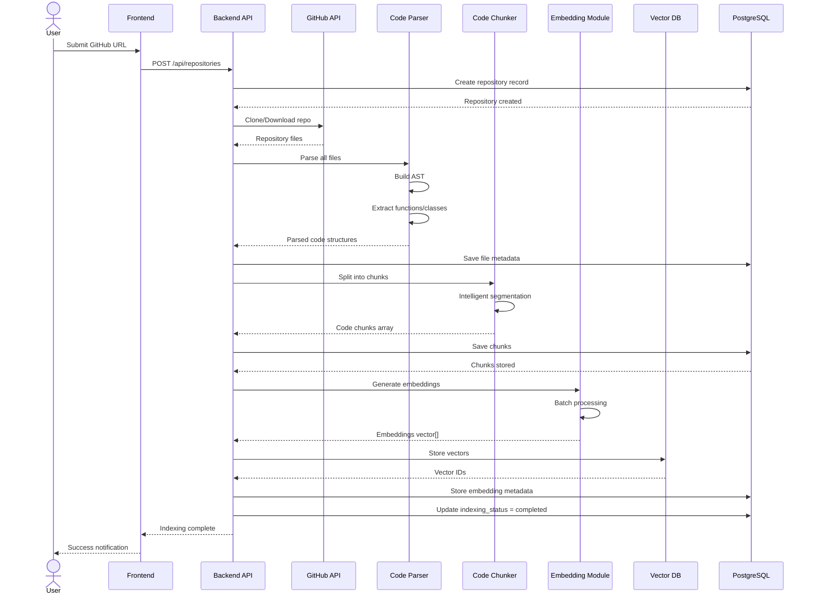

## Sequence Diagram - Chat Query Flow

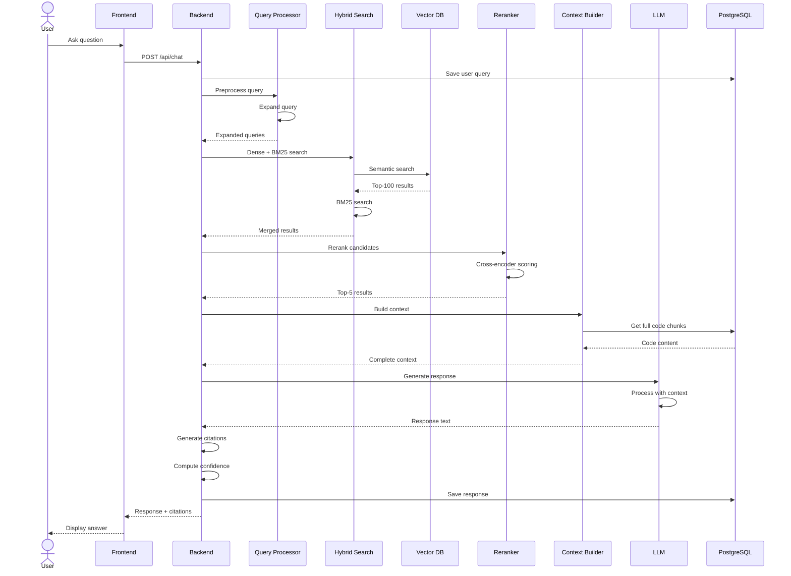

## State Diagram - Repository Indexing

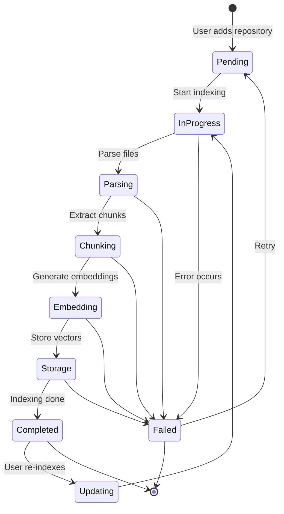

## Activity Diagram - Code Analysis Pipeline

```mermaid
activity
    start
    :User uploads GitHub URL;
    :Validate repository access;
    decision {Clone successful?}
        --(No)--> :Log error;
        :Notify user;
        stop
        --(Yes)-->
    :Extract all files;
    :Filter by file type;
    :Read file contents;
    :Parse with Tree-Sitter;
    :Build Abstract Syntax Tree;
    partition "Parallel Processing" {
        :Extract functions;
        :Extract classes;
        :Extract imports;
        :Extract comments;
    }
    :Merge extracted data;
    :Create code chunks;
    :Generate embeddings;
    fork
        :Store in Vector DB;
    and
        :Store in PostgreSQL;
    end fork
    :Build dependency graph;
    :Analyze architecture;
    :Generate metadata;
    :Update repository status;
    :Notify user of completion;
    stop
```

## Component Diagram - System Components

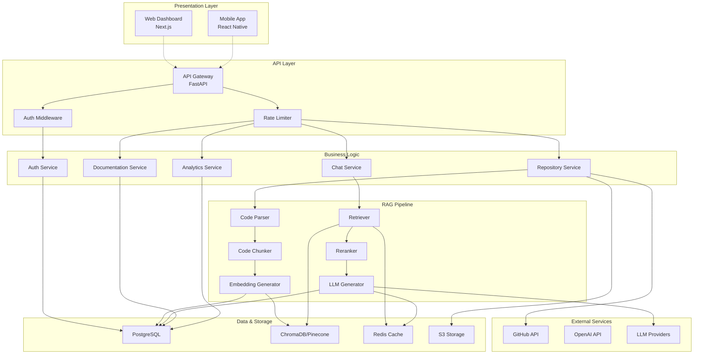

## Deployment Diagram

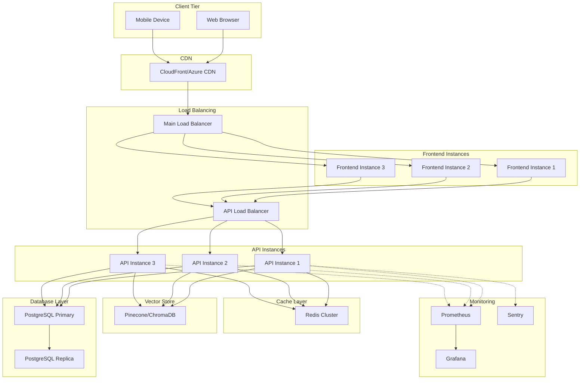

## Data Flow Diagram - Detailed Chat Processing

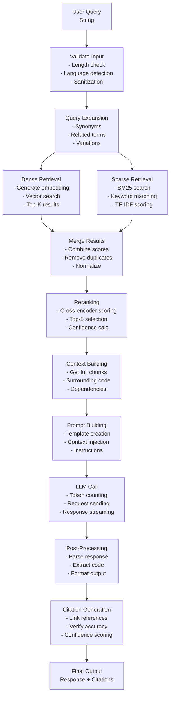

## Use Case Diagram

```mermaid
usecase
    UC_User as "(A) User"
    UC_Dev as "(B) Developer"
    UC_Org as "(C) Organization"
    
    UC_Browse as "Browse Codebase"
    UC_Chat as "Ask AI Questions"
    UC_Generate_Docs as "Generate Documentation"
    UC_Analyze_Arch as "Analyze Architecture"
    UC_Track_Deps as "Track Dependencies"
    UC_Manage_Repos as "Manage Repositories"
    UC_View_Analytics as "View Analytics"
    UC_Collaborate as "Collaborate with Team"
    
    UC_User --> UC_Chat
    UC_User --> UC_Browse
    
    UC_Dev --> UC_Chat
    UC_Dev --> UC_Analyze_Arch
    UC_Dev --> UC_Track_Deps
    UC_Dev --> UC_Generate_Docs
    UC_Dev --> UC_Manage_Repos
    
    UC_Org --> UC_View_Analytics
    UC_Org --> UC_Collaborate
    UC_Org --> UC_Manage_Repos
```

## Entity Relationship Diagram (Visual)

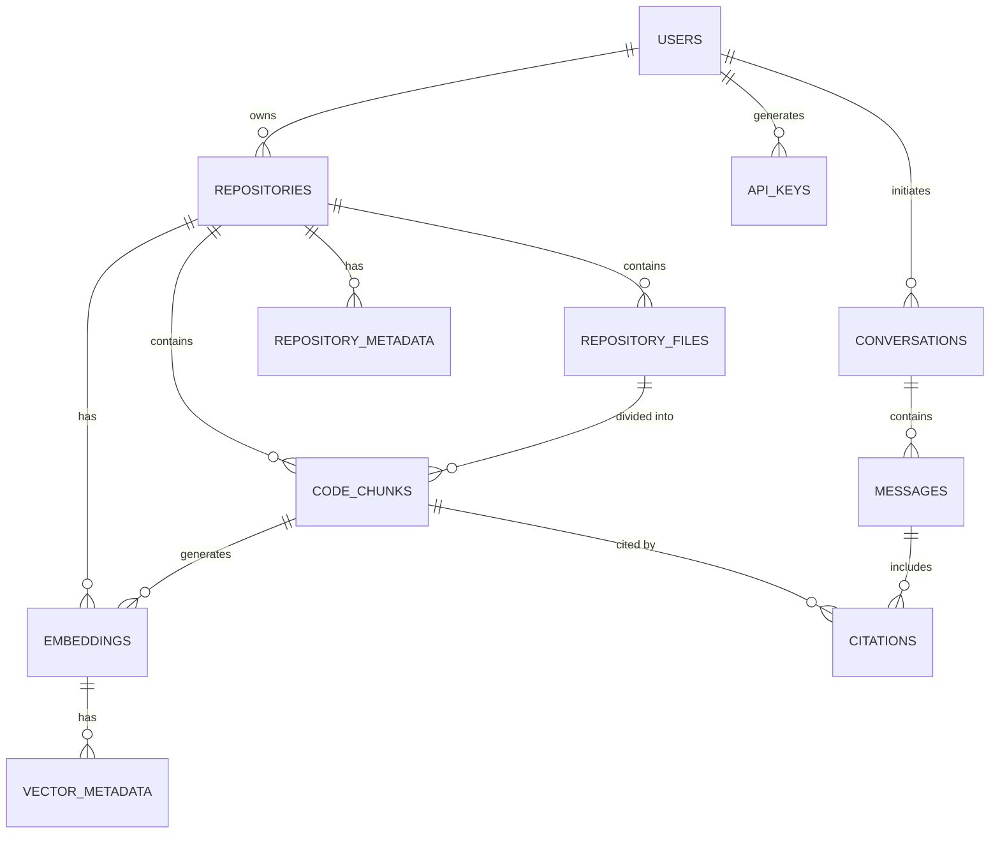

## Technology Stack Diagram

```mermaid
graph TB
    subgraph Frontend["Frontend Layer"]
        N["Next.js 15"]
        R["React 18"]
        TS["TypeScript"]
        TC["Tailwind CSS"]
        SH["ShadCN UI"]
        Z["Zustand"]
        FM["Framer Motion"]
    end
    
    subgraph Backend["Backend Layer"]
        F["FastAPI"]
        P["Python 3.12"]
        PD["Pydantic"]
        A["AsyncIO"]
    end
    
    subgraph AI["AI & ML Layer"]
        LC["LangChain"]
        LG["LangGraph"]
        TS1["Tree-Sitter"]
        OAI["OpenAI API"]
        CE["Cross-Encoder"]
    end
    
    subgraph Data["Data Layer"]
        PG["PostgreSQL 15"]
        CD["ChromaDB/Pinecone"]
        RD["Redis"]
        SA["SQLAlchemy"]
    end
    
    subgraph Deployment["Deployment"]
        DK["Docker"]
        DC["Docker Compose"]
        K8S["Kubernetes"]
        AZ["Azure/AWS"]
    end
    
    N --> TS
    R --> TC
    TC --> SH
    SH --> Z
    Z --> FM
    
    F --> P
    P --> PD
    PD --> A
    
    LC --> LG
    LG --> TS1
    TS1 --> OAI
    OAI --> CE
    
    SA --> PG
    PG --> CD
    CD --> RD
    
    DK --> DC
    DC --> K8S
    K8S --> AZ
```

## Machine Learning Pipeline

```mermaid
graph LR
    INPUT["Raw Code"]
    PARSE["Parse Code<br/>Tree-Sitter"]
    FEATURE["Extract Features<br/>- Syntax<br/>- Semantics<br/>- Structure"]
    CHUNK["Create Chunks<br/>Intelligent Segmentation"]
    EMBED["Generate Embeddings<br/>text-embedding-3-large"]
    NORM["Normalize Vectors<br/>L2 Normalization"]
    INDEX["Build Index<br/>HNSW"]
    QUERY["Query Processing<br/>Semantic Search"]
    RERANK["Reranking<br/>Cross-Encoder"]
    CONTEXT["Context Window<br/>Retrieved Chunks"]
    LLM["LLM Processing<br/>GPT-4o/Llama"]
    OUTPUT["Response<br/>+ Citations"]
    
    INPUT --> PARSE
    PARSE --> FEATURE
    FEATURE --> CHUNK
    CHUNK --> EMBED
    EMBED --> NORM
    NORM --> INDEX
    INDEX --> QUERY
    QUERY --> RERANK
    RERANK --> CONTEXT
    CONTEXT --> LLM
    LLM --> OUTPUT
```

## System Quality Attributes

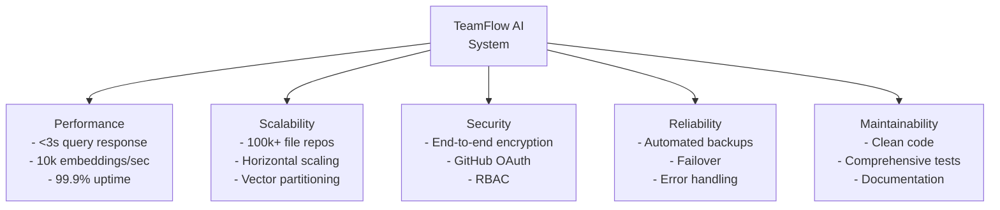

## Conclusion

These diagrams provide a comprehensive view of:
- System structure and components
- Data flows and interactions
- Deployment architecture
- Technology integration
- Quality attributes and design patterns
